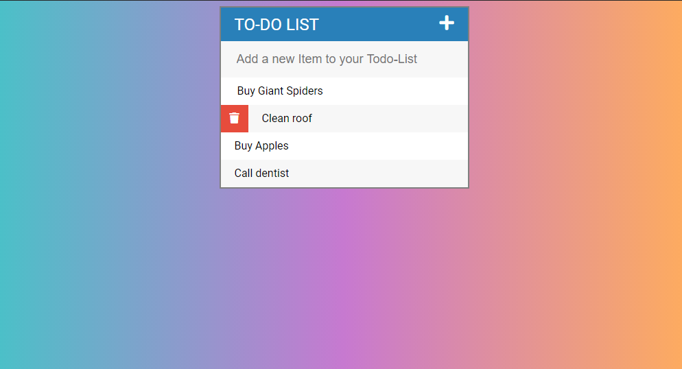

# Todo-App
 
 This is a simple ToDo-App that I have built in HTMl, CSS, JS - jQuery ( also fontAwsome )
 to improve my Web development skills. 
 This App is open source and free to use/share. 
 <strong>Functionality:</strong> Adding new Items and crossing them off or deleting them.
Screenshot of the App : 
